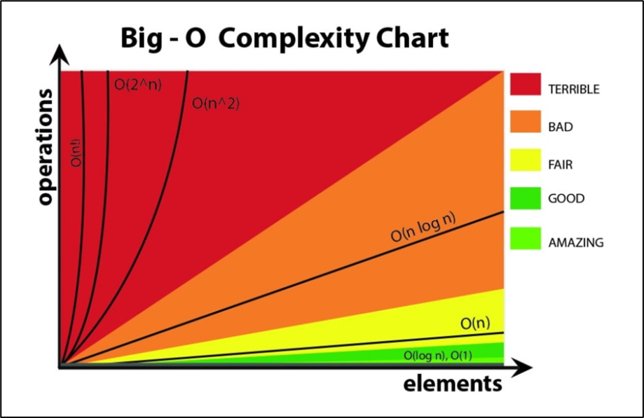

# 0. 코딩테스트와 시간/공간 복잡도

# 1. 코딩 테스트

## 1. 개요

자주 출제되는 알고리즘 종류

- 완전탐색: BFS / DFS
- Dijkstra
- Sliding Window / Two Pointer
- Greedy / Heap
- DP
- Union-Find / MST

현업에서 쓰느냐?

- 거의 안 씀

대체 왜 준비하냐?

- 기업 채용 시 요구함
- 승진 가산점
- 토익같은 존재. 머리 좋은지, 코딩 센스 있는지 알아보는 것

어떻게 하면 잘하나?

- 쉬운 문제 많이 풀기
- 멘탈 관리

## 2. 쉬운 문제 많이 풀기

초보는 무엇을 하면 안되나?

- 기초 다질 때까진 기출 풀면 안됨
- 티스토리, 네이버 블로그 정리해놓은 자료 보면 안됨
- 왜? 달달 외우게 되서, 실제 시험장에선 응용을 못함
    - 만약 DFS 유형 자신있게 포맷을 달달 외웠다?
    - 하지만 시험에선 포맷에서 벗어난 문제가 나옴
        - 방문 기록이 없어도 된다던지, BFS 도 써야한다던지, 원상복구 안한다던지…
        - BFS/DFS 자신있게 연습했지만, 간단한 반복문만으로 풀 수 있는 문제를 못푼다던지…

쉬운 문제의 예시

- 한 문자열 입력받아, 가장 많이 등장하는 알파벳 갯수 출력
    - ex) ASADADAS
- 위와 같은 유형이 출제된다는게 아니라, 저런 문제로 사고력을 높여야 함

착각하기 쉬운 것

- 기초 이론 알겠으니 초보를 벗어났겠지?
- 아니다. 문제 나오면 지루할 정도로, 익숙해져야 초보를 벗어난 것
    - 재귀 강의 들었고 몇 문제 풀어보았다 (X)
    - 재귀 유형 아무거나 봐도, 손이 알아서 풀더라 (O)

추천 훈련 방법

- 매일 쉬운 문제, 적어도 두 문제씩 매일매일
- 컨디션 좋으면 더 풀자
- 초보라면 아무리 쉬운 문제라도, 세 시간 이상 한 문제만 풀어볼 각오 해야 함

## 3. 멘탈 관리

남은 잘하는데 나는 왜 몇 개월을 해도 이 정도일까?

⇒ 아무리 머리 안 좋아도, 기업 코테 수준은 노력만 하면 합격 가능

⇒ 노력이 부족한 것. 절대로, 남 신경쓰지 말자.

## 4. 추천 언어

세 가지 중 하나 정해서 하면 됨

C++ : 다른 언어보다 머리 많이 써야함. (사이즈부터 일일히 잡아줘야 함)

Java : 웹 개발자라면 현업 언어이므로 미리 경험

Python : 생각 좀 덜해도 되는게 장점. AI/Data 직군이라면 추천

나는 JavaScript 가 좋아요!

- JavaScript 코테는 요구사항이 다름…
    - 프로젝트형 문제라던가… REST 통신을 해본다던가…
- Rust 가 요새 뜬다면서요?
    - 코테에서 안보는데 어떡함…

## 5. 기타

- 스터디 추천하나요?
    - 혼자 하는걸 추천합니다.
    - 스터디원 잘못 만나면 안 하느니만 못합니다.
- 종만북 같은 거 봐야하나요?
    - 종만북: 프로그래밍 대회에서 배우는 알고리즘 문제해결전략
        - 저자: 구"종만"
        - 출판사: 인사이트
    - 전국대회, 세계대회 나갈 거 아니면 안 봐도 됩니다.

# 2. 각 언어 기본 코드

## 1. C++

```cpp
#define _CRT_SECURE_NO_WARNINGS
#include <iostream>

using namespace std;

int main()
{
    // freopen("sample_input.txt", "r", stdin);
    int n;
    cin >> n;
    cout << "n: " << n;
    return 0;
}
```

## 2. Java

```java
import java.io.*;
import java.util.*;

public class Solution {
    private static int n;

    public static void main(String args[]) throws Exception {
        // System.setIn(new FileInputStream("src/sample_input.txt"));
        Scanner sc = new Scanner(System.in);
        n = sc.nextInt();
        System.out.println("n: " + n);
    }
}
```

## 3. Python

```python
import sys

# sys.stdin = open("sample_input.txt", "r")

n = int(input())
print(f'n: {n}')
```

# 3. 시간복잡도

복잡도를 알아야 하는 이유: 시간/공간복잡도 조율 가능 (Trade off 관계)

- 메모리 공간을 많이 사용 ⇒ 프로그램 성능이 빨라짐
- 시간을 소모 ⇒ 메모리 공간을 아낌

시간복잡도

- 최악의 입력값이 들어왔을 때, 최대 반복횟수 (빅오표기법 사용)
- 프로그램의 성능을 반복문을 기준으로 아주 간략하게 표현
    - 정확한 성능을 나타내지 못하지만, 쉽게 성능을 표현할 수 있다.
- N값이 커지면 커질수록, 정확한 값에 가까워짐

공간복잡도

- 메모리를 얼만큼 쓰는지 (메모리 사용량 계산)

## 1. O(𝑛)

- 오더엔 이라고 읽음
- 입력 받은 수 만큼 반복하는 1중 for문

```cpp
int n;

cin >> n;

for (int i = 0; i < n; i++)
{
    // ...
}
```

```python
public class Solution {
    private static int n;

    public static void main(String args[]) throws Exception {
        // System.setIn(new FileInputStream("src/sample_input.txt"));
        Scanner sc = new Scanner(System.in);
        n = sc.nextInt();

        for (int i = 0; i < n; i++)
        {
            // ...
        }
    }
}
```

```python
# sys.stdin = open("sample_input.txt", "r")

n = int(input())
for i in range (0, n):
    # ...
    pass
```

이건 어떨까?

```cpp
int n;

cin >> n;

for (int i = 0; i < n; i++)
{
    // ...
}

for (int i = 0; i < n; i++)
{
    // ...
}

for (int i = 0; i < n; i++)
{
    // ...
}
```

O(3n) 으로 표기해야 할 것 같지만 더 간략하게 O(n)으로 표기한다.

## 2. O(1)

- 입력값과 상관없이 일정한 속도를 보이는 프로그램을 Order 1 로 표현
- "상수" 횟수만큼 반복하는 것은 O(1)

```cpp
for (int i = 0; i < 6; i++)
{
    // ...
}

for (int i = 0; i < 10000; i++)
{
    // ...
}
```

- 빅오표기법에서는 통상적으로 O(n) 보다 O(1)이 더 빠른 알고리즘이라고 판단

```cpp
for (int i = 0; i < 10000; i++)
{
    for (int j = 0; j < 10000; j++)
    {
        // ...
    }
}
```

반복 횟수는 10000 * 10000 이므로, 아주 느린 프로그램

만약 n 을 입력받는 프로그램의 경우, n 값에 따라서 반복 횟수가 달라짐

그러나, 위 프로그램은 일정하게 10000 * 10000 으로 반복

따라서, O(1) 로 판단.

## 3. O(𝑛^2)

오더 엔제곱은 n값으로 반복하는 이중 for 문을 나타냄

```cpp
int n;

cin >> n;

for (int i = 0; i < n; i++)
{
    for (int j = 0; j < n; j++)
    {
        // ...
    }
}
```

아래 네 개의 코드 역시 오더 엔제곱이다.

시간 복잡도는 항상 "최대" 시간복잡도로 계산

```cpp
int n;

cin >> n;

for (int i = 0; i < n; i++)
{
    for (int j = 0; j < n; j++)
    {
        // ...
    }
    
    for (int j = 0; j < n; j++)
    {
        // ...
    }
}
```

```cpp
int n;

cin >> n;

for (int i = 0; i < n; i++)
{
    for (int j = 0; j < n; j++)
    {
        // ...
    }
}

for (int i = 0; i < n; i++)
{
    for (int j = 0; j < n; j++)
    {
        // ...
    }
}
```

```cpp
int n;

cin >> n;

for (int i = 0; i < n; i++)
{
    for (int j = 0; j < n; j++)
    {
        // ...
    }
}

for (int i = 0; i < n; i++)
{
    // ...
}
```

```cpp
void func()
{
    for (int i = 0; i < n; i++)
    {
        // ...
    }
}

int main()
{
    int n;

    cin >> n;

    for (int i = 0; i < n; i++)
    {
        func();
    }
}
```

## 4. O(log⁡𝑛)

- 오더 로그엔
- 주로 이진트리를 활용한 알고리즘에서 이러한 성능이 나옴
    - 이진탐색. 아무리 많아도, 반으로 줄이고 또 반으로 줄이다보면 상수 시간대로 끝남
- n 값이 커져도, 반복 횟수가 크게 증가하지 않아 가장 이상적인 시간복잡도
    - O(𝑛) 에서 n값이 100,000 일때 반복 횟수는?  100,000번
    - O(𝑛^2) 에서 n값이 100,000 일때 반복 횟수는? 10,000,000,000 (100억 번)
    - O(log⁡𝑛) 에서 n값이 100,000 일때 반복 횟수는? 2^15.61 = 100,000 이므로 약 16번
- 즉, O(1), 상수 시간복잡도와 근접하다고 할 수 있다.

## 5. O(n log⁡𝑛)

- O(log⁡𝑛) 알고리즘을 n 번 반복하는 알고리즘
- O(n) 과 비슷한 성능을 보인다.
- 일반적인 코딩 테스트에서 추구하는 시간복잡도
    - 병합정렬, 퀵정렬, 힙정렬



# 4. 공간복잡도

메모리를 얼마나 사용하는지 계산

## 1. 프로세스의 메모리 세그먼트 구조

| Stack : 지역 변수 |
| --- |
| Heap : new / malloc 할당 |
| BSS / Data : 전역 변수 |
| Code : 0 과 1 로 이루어진 소스코드 |

공간복잡도 계산 시, Stack 과 Code 는 10MB 미만이기 때문에 무시한다.

기본적으로 Stack 에 배정된 메모리 사이즈는 1MB

아래는 예외가 발생한다.

```cpp
#include <iostream>

using namespace std;

int main()
{
    // Stack overflow 예외 발생
    int vect[1000000];
}
```

- int형 변수 하나 사이즈 : 4Byte
- 4Byte x 1,000,000 = 4,000,000 Byte (약 4MB)

따라서, 크기가 큰 배열일 경우 전역변수로 두는 것이 적절하다.

- Java 와 Python 의 경우, 사이즈를 따로 잡지 않기 때문에 이 부분에선 자유로움

## 2. 메모리 계산을 위해 외워야할 변수 사이즈

- char : 1Byte
- int : 4Byte
- double : 8Byte
- long long (long): 8Byte
- 포인터 : 8 Byte ( 32bit 컴파일시 4Byte )
    - 포인터는 주소를 저장해야 하는데, 어떤 타입이 올지 모르기 때문에 기본적으로 8Byte
    - Java 와 Python 은 포인터가 없다.

## 3. 메모리 사용량 계산하기

```cpp
int arr[100];
char vect[50];
long long t[20];
double nums[50];
```

100 * 4 Byte +

50 * 1 Byte +

20 * 8 Byte +

50 * 8 Byte

= 1,010 Byte / 1024 = 약 1KB

# 과제

내일은 DAT 시간이다. 아래 문제를, 스스로 개념을 학습해온 후 풀어오자.

- Java: DAT
- Python: Dictionary

1. 배열(파이썬은 리스트)에 어떤 종류의 알파벳들이 있는지 찾아내는 프로그램을 작성하시오
    
    입력예시: A D B F A D
    
    출력예시:  ABDF (정렬 여부는 상관없음)
    

1. 입력예시: 4 1 1 1 5 4
각각의 숫자가 몇 개인지 출력하라.
    
    출력예시:
    
    1:3개
    4:2개
    5:1개